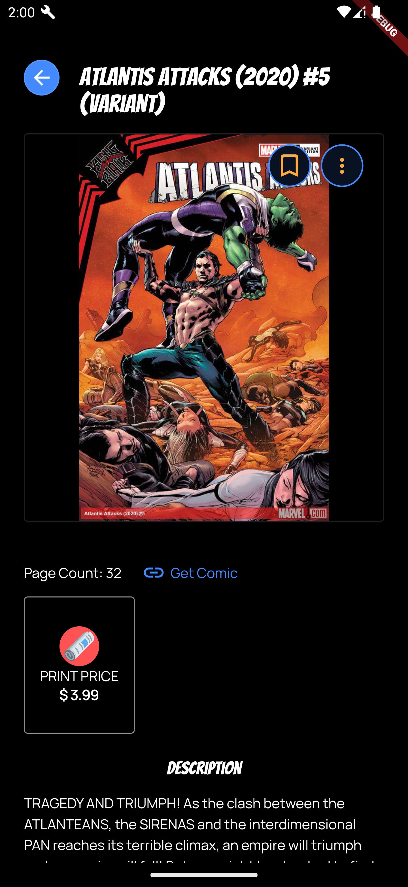
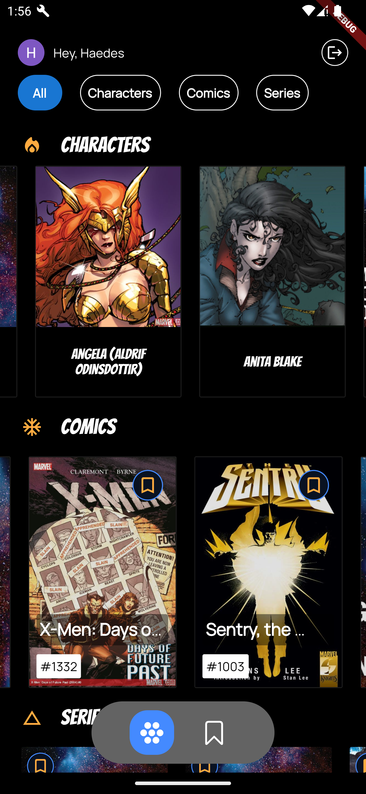

Comics Center
=============


## Project Description
This is an application that helps you navigate your way thru Marvel's Characters, Comics and Series

## Tech Stack
1. Flutter
2. Supabase

## Features
1. Bookmark Marvel Comics and Series
2. Search for characters, comics and series
3. Showcase pages that will enable you get the comic from Marvel.
4. Save Comic Posters

## Preview
link to be added

## Project Setup
To run this app and get access to all the features:

1. You will need to link it to a supabase project.
    - The app uses supabase auth (Google). Check [here](https://supabase.com/blog/flutter-authentication).

    - You have to create a bookmarks table too. Check out [Use Supabe With flutter](https://supabase.com/docs/guides/getting-started/quickstarts/flutter) 

    ```
    create table bookmarks (
        pk character varying(255) not null,
        name text not null,
        thumbnail text null,
        userid character varying(255) not null,
        id character varying(255) not null,
        type character varying(255) not null,
        constraint bookmarks_pkey primary key (pk)
    ) tablespace pg_default;
    ```


2. Marvel Developer Api Keys

3. The app also uses the [flutter dotenv](https://pub.dev/packages/flutter_dotenv)
   - You need to provide the following values in the .env file
     1. PUBLIC_KEY - Marvel developer public key
     2. PRIVATE_KEY - Marvel developer private key
     3. SUPABASE_APP_URL - Supabase app url
     4. SUPABASE_ANON_KEY - Supabase anon key
     5. APP_WEB_CLIENT - Google app web client, the one you provided whiles following [here](https://supabase.com/blog/flutter-authentication).

4. Make sure the Google Sign in method is set up correctly. Creating a firebase     project makes this step easier.

### For IOS 
- Make sure the following packages are set up correctly
    1. google_sign_in
    2. flutter_downloader

## Prerequisites
-  Flutter version used is 3.7.12
-  Supabase app

## Participants
- [@IssahAsiedu](https://www.github.com/IssahAsiedu) | C# & Dart
- Evans Mbongo- [luckyevance3@gmail.com](luckyevance3@gmail.com) | App Icon designer

<table>
    <tr>
        <td></td>
        <td></td>
    </tr>
</table>
