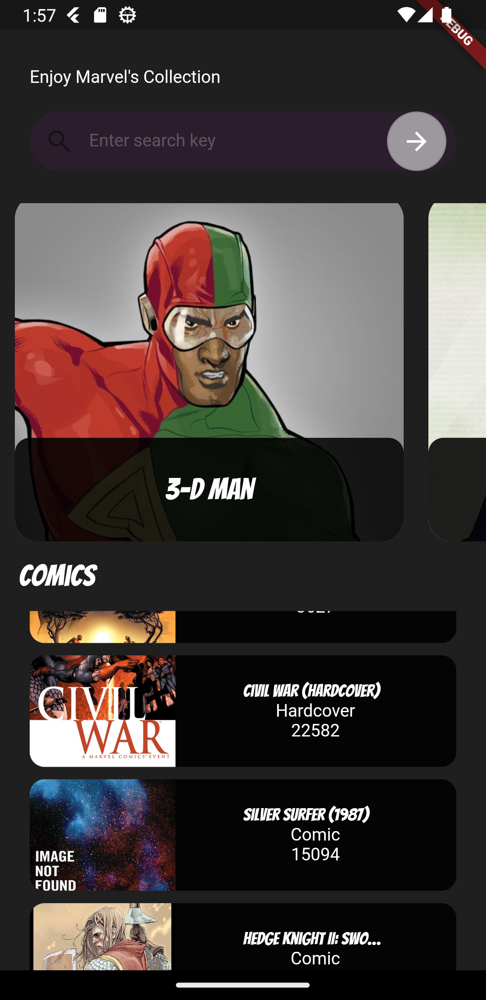
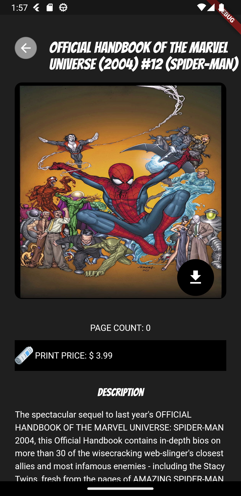

# comics_center

A new Flutter project.

## Getting Started

A flutter application that fetches comics from the marvel api.

    Currently, the images of comics can only be downloaded on android.

 Flutter version used is 3.7.12

<table>
    <tr>
        <td></td>
        <td></td>
    </tr>
</table>
